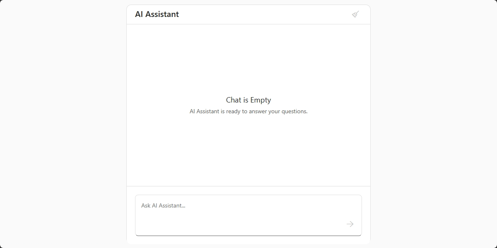
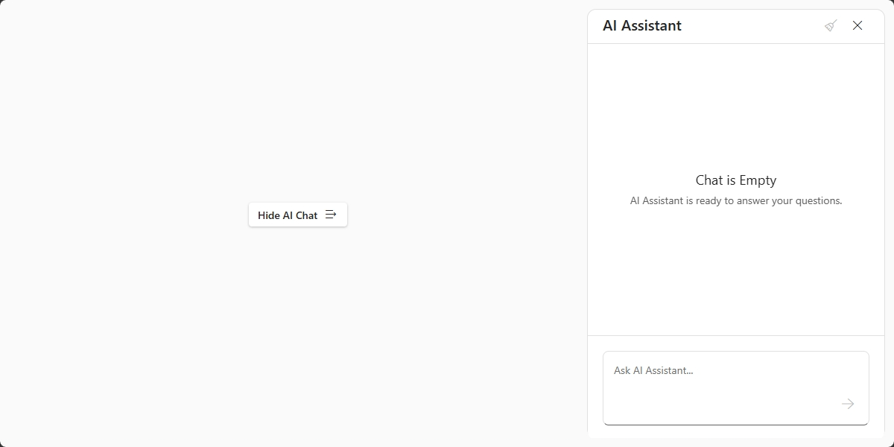
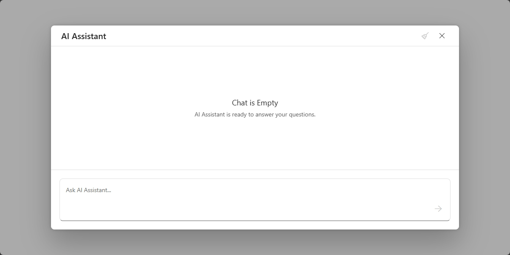

<!-- default badges list -->

<!-- default badges end -->
# DevExtreme Chat - Clear Button

This repository contains code referenced in the following DevExtreme help topic: [Implement an AI Chat Clear Button](https://js.devexpress.com/Documentation/Guide/UI_Components/Chat/Implement_an_AI_Chat_Clear_Button/).

This example integrates DevExtreme Chat with [AzureOpenAI](https://developers.openai.com/api/reference/typescript#microsoft-azure-openai) and configure a **Clear Chat** button. This button clears old messages and allow you to start new AI conversations with fresh context windows. 

- **Standalone AI chat**

- **AI chat within a DevExtreme Drawer**

- **AI chat within a DevExtreme Popup**

Obtain your own API key on the [Azure Portal](https://portal.azure.com/) and replace the placeholder to use our implementation:

- **jQuery**: [`data.js#L1-L4`](/jQuery/src/data.js#L1-L4)
- **Angular**: [`app.service.ts#L20-L24`](/Angular/src/app/app.service.ts#L20-L24)
- **Vue**: [`chat.helpers.ts#L15-L19`](/Vue/src/helpers/chat.helpers.ts#L15-L19)
- **React**: [`data.ts#L4-L8`](/React/src/data.ts#L4-L8)
- **ASP.NET Core**: [`_Layout.cshtml#L61-L64`](/ASP.NET%20Core/Views/Shared/_Layout.cshtml#L61-L64)

## Files to Review

- **jQuery**
    - [full-page.js](jQuery/src/examples/full-page.js)
    - [drawer.js](jQuery/src/examples/drawer.js)
    - [popup.js](jQuery/src/examples/popup.js)
- **Angular**
    - [full-page.component.html](Angular/src/app/examples/full-page/full-page.component.html)
    - [full-page.component.ts](Angular/src/app/examples/full-page/full-page.component.ts)
    - [drawer.component.html](Angular/src/app/examples/drawer/drawer.component.html)
    - [drawer.component.ts](Angular/src/app/examples/drawer/drawer.component.ts)
    - [popup.component.html](Angular/src/app/examples/popup/popup.component.html)
    - [popup.component.ts](Angular/src/app/examples/popup/popup.component.ts)
- **Vue**
    - [full-page.vue](Vue/src/pages/Examples/full-page.vue)
    - [drawer.vue](Vue/src/pages/Examples/drawer.vue)
    - [popup.vue](Vue/src/pages/Examples/popup.vue)
- **React**
    - [FullPage.tsx](React/src/pages/FullPage.tsx)
    - [Drawer.tsx](React/src/pages/Drawer.tsx)
    - [Popup.tsx](React/src/pages/Popup.tsx)
- **ASP.NET Core**    
    - [FullPage.cshtml](ASP.NET%20Core/Views/Examples/FullPage.cshtml)
    - [Drawer.cshtml](ASP.NET%20Core/Views/Examples/Drawer.cshtml)
    - [Popup.cshtml](ASP.NET%20Core/Views/Examples/Popup.cshtml)

## Documentation

- [Chat - Getting Started](https://js.devexpress.com/React/Documentation/Guide/UI_Components/Chat/Getting_Started_with_Chat/)
- [Integrate with AI Service - OpenAI](https://js.devexpress.com/Documentation/Guide/UI_Components/Chat/Integrate_with_AI_Service/#OpenAI)
- [Chat - API](https://js.devexpress.com/React/Documentation/ApiReference/UI_Components/dxChat/)

<!-- feedback -->
## Does This Example Address Your Development Requirements/Objectives?

 

(you will be redirected to DevExpress.com to submit your response)
<!-- feedback end -->
